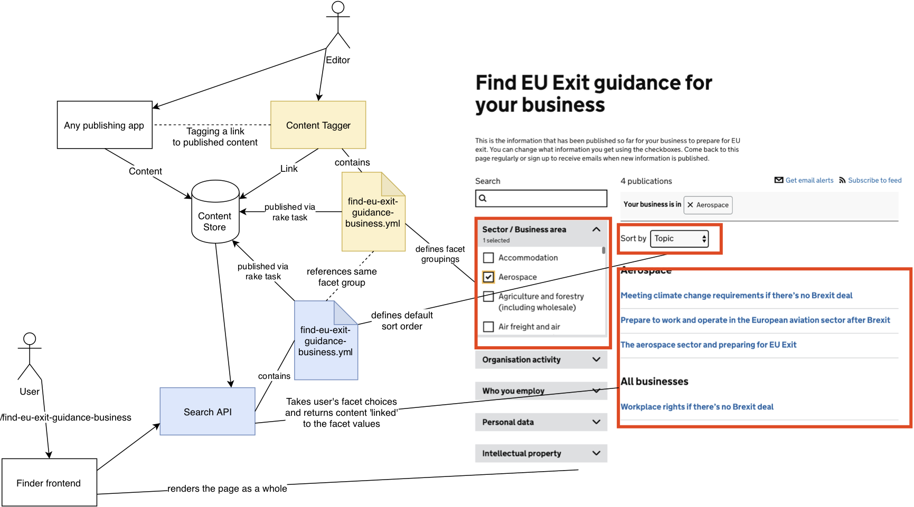

# EU Exit Readiness Business Finder Tagging

This document explains why the [EU Exit Business Readiness Finder](https://www.gov.uk/find-eu-exit-guidance-business) ("business finder") uses [content-tagger](https://github.com/alphagov/content-tagger) 'links' to filter the finder.

## How the business finder is different to other finders

### From the user perspective

In most finders, search results get more granular as you select values in different facets (the number of results goes down).

The business finder search results get more _broad_ as you select values in different facets (number of results goes up).

### From the content designer perspective

In most finders, facets are published as part of the content item itself. This means  when the content item is updated via its publishing API, the facets are updated too and associated with the change note accompanying the change. This triggers an email to subscription lists which are subscribed to that facet, and the change note appears in the email body.

> TODO: describe how content designers 'tag' standard finder content (and maybe touch upon 'deprecated tags'), before moving onto...:

The business finder retrieves content from multiple different publishing apps, therefore facets are published independently:

- There is a ['facet group' associated with the business finder](https://content-tagger.integration.publishing.service.gov.uk/facet_groups). The facet group has a number of possible facets (e.g. "Sector / Business Area"), each of which have a number of possible facet values (e.g. "Accommodation"), which is a [manually curated list in YAML](https://github.com/alphagov/content-tagger/blob/master/lib/data/find-eu-exit-guidance-business.yml).
- Content designers follow the [How to tag content with facet values](https://docs.publishing.service.gov.uk/manual/tag-content-with-facet-values.html) instructions to tag a particular piece of content (e.g. "/government/publications/workplace-rights-if-theres-no-brexit-deal") with a particular facet value (e.g. "Accommodation").
- Content designers can choose whether or not to trigger an email alert for the tagging by checking the `Notify email subscribers that this content has been tagged` box and filling in a change note.

The content will now appear in the search results of the business finder when that facet value is selected.

## How this works technically

Standards finders use facets that have been published as part of the content item itself, which therefore appear under `details["facets"]` in the [content item JSON](https://www.gov.uk/api/content/cma-cases).

The business finder uses facets that reference 'links' published by content-tagger, which therefore appear under `links["facet_group"]` in the [business finder content item JSON](https://www.gov.uk/api/content/find-eu-exit-guidance-business).

Let's call these "details-based facets" and "link-based facets" respectively.

Details-based facets are part of the content item itself, so when the content item is updated via its publishing API, they're updated too and associated with the change note accompanying the change. This triggers an email to subscription lists which are subscribed to that facet, and the change note appears in the email body.

This wouldn't work very well for the business finder, as we would have had to add an interface to every publishing app.

The link-based facets approach means:

1. We don't have to change any publishing app interface.
2. Content editors have complete control over when an email update should be sent out.
3. Content can be freely re-tagged whenever the user needs change.

Link-based facets require a separate `patch_links` call to publishing-api to be associated with the content. The single source of truth for links therefore lies with the publishing-api.

The publishing apps that do allow users to tag content in links will pull the existing links from publishing-api first before updating (i.e. tagging to taxons in Whitehall), so there was no migration work to be done.

The facet groups, facets and values are duplicated in a few places however, so any changes require carefully following the [Updating the business readiness finder](https://docs.publishing.service.gov.uk/manual/business-readiness-publish-changes.html#updating-the-business-readiness-finder) instructions.
